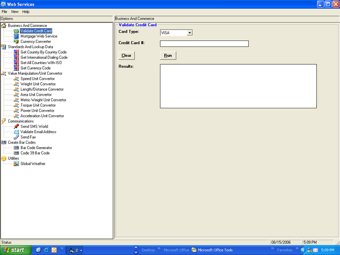



## Web Services Example

### Description

This Program is an example how to call and use multiple Web Services from http://www.webservicex.net/WS/default.aspx

I designed the program so I can cut and paste the code I need into other programs. This is my first submission, so please be kind. The program is not fully completed and good use some improvements and updates. Please give feed back.
 
### More Info
 
It will return a value from a web service

No side effects

             |
---                |---
**Submitted On**   |2006-08-15 16:51:12
**By**             |[TheBatMan](https://github.com/Planet-Source-Code/PSCIndex/blob/master/ByAuthor/thebatman.md)
**Level**          |Intermediate
**User Rating**    |4.7 (14 globes from 3 users)
**Compatibility**  |VB 6\.0
**Category**       |[Miscellaneous](https://github.com/Planet-Source-Code/PSCIndex/blob/master/ByCategory/miscellaneous__1-1.md)
**World**          |[Visual Basic](https://github.com/Planet-Source-Code/PSCIndex/blob/master/ByWorld/visual-basic.md)
**Archive File**   |[Web\_Servic2013648152006\.zip](https://github.com/Planet-Source-Code/thebatman-web-services-example__1-66282/archive/master.zip)

